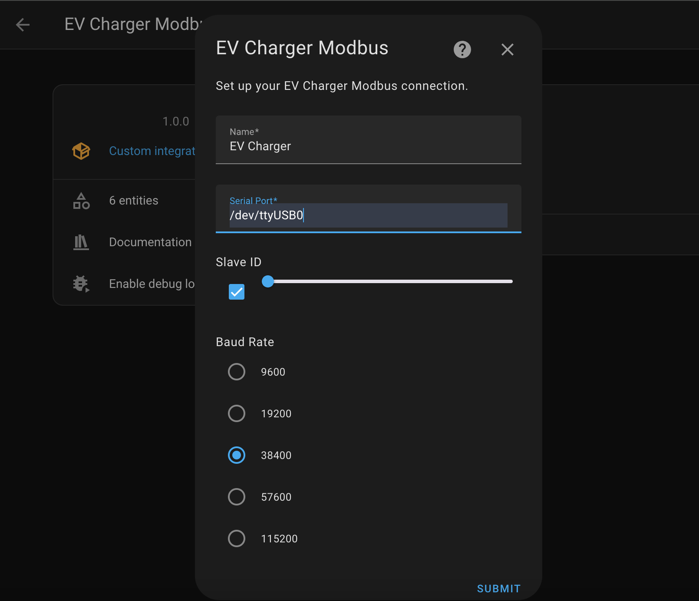

# Home Assistant AddOn for setting max current on ABL EMH1 charger over RS485 MODBUS

Allows you to connect the ABL EMH1 charger over RS485 modbus connection to homeassistant and update the max charging current, read sensors and enable or disable the charger. The RS485 connection typically can happen over a USB or any other serial signal converter.

## Installation:
Add the files to your /custom_components/ folder or use the "+" in the integrations tabs

1. Use [HACS](https://hacs.xyz/docs/setup/download), in `HACS > Integrations > Explore & Add Repositories` search for "ev charger". After adding this `https://github.com/matfroh/abl_emh1_modbus` as a custom repository, go to 7.
2. If you do not have HACS, use the tool of choice to open the directory (folder) for your HA configuration (where you find `configuration.yaml`).
3. If you do not have a `custom_components` directory (folder) there, you need to create it.
4. In the `custom_components` directory (folder) create a new folder called `ev_charger_modbus`.
5. Download the files from the `custom_components/ev_charger_modbus/` directory (folder) in this repository.
6. Place the files you downloaded in the new directory (folder) you created.
7. Restart Home Assistant.
8. Add the integration: [![Add Integration][add-integration-badge]][add-integration] or in the HA UI go to "Settings" -> "Devices & Services" then click "+" and search for "EV charger Modbus".
9. Input the right parameter

and restart home assistant.

## Usage:
You should now be able to 

## Test:

Find the service and send the update!
Select either 0 Amps or any value between 5 and 16

A switch has been created and can be found in the entities. This enables disabling the charger or enable the charger if it was previously disabled.
The switch scans the state of the charger to be in the right position.
Disabling the charger and setting to 0 amperes has some nuances where depending on your use case, one is better fitted.

As well, one can set the charging current with the slider. The default value is 16 amperes. In case of errors, it stays on 16 amperes.
The charger will only accept values between 5 and 16 and will stop charging on 0.

---
[add-integration]: https://my.home-assistant.io/redirect/config_flow_start?domain=ev_charger_modbus
[add-integration-badge]: https://my.home-assistant.io/badges/config_flow_start.svg
